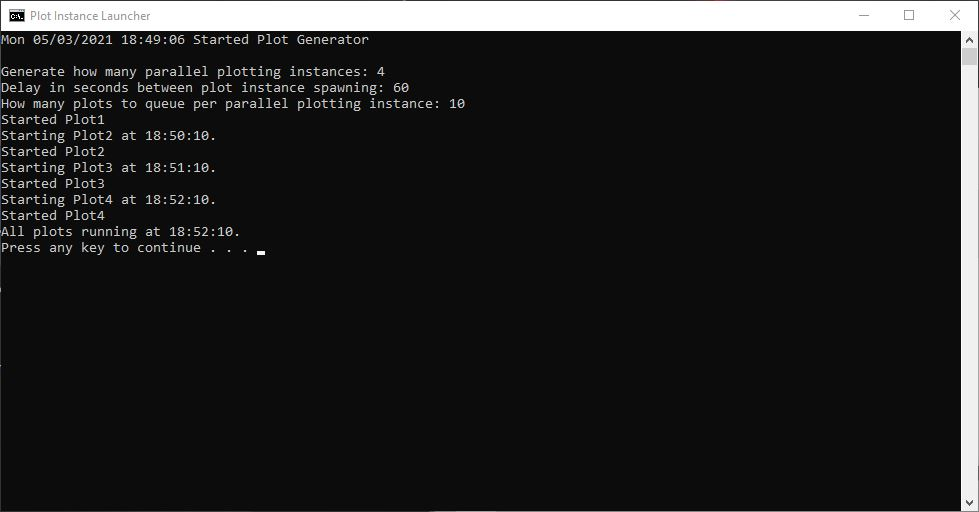

# Chia-Plot-Instance-Launcher
Launches multiple Chia plotting instances with user specified options

To use Chia Plot Instance Launcher:

Download Plot-Instance-Launcher.bat.  Move a copy to your chia daemon folder.  To find the folder, right click your Chia wallet shortcut and click "Open file location".  Then open the following folders app-1.1.3\resources\app.asar.unpacked\daemon (1.1.3 will change depending on wallet version).  Right click the file, drag to the desktop and "Create shortcut here" for easy launching.  You may need to move a new copy of Plot Instance Launcher to the daemon folder whenever you update the wallet and will need to update the shortcut every time you update the wallet.

Right click the file and select edit.  Some default settings have been provided, but you will need to modify at least some settings in the file.  At the minimum you need to set up the temporary directory and destination directory.  Take note that spaces in the path are not supported and must end in \.

You can also specify plotsize, amount of ram, amount of threads.

Optional advanced options for temporary directory 2, log file output, farm and pool keys for when plotting on a machine without the same wallet key as the harvester / primary wallet and an option to specify that the file is a duplicate (used for when you want to setup multiple copies of the instance launcher for different SSDs).

Launch the batch file once all settings are specified and you will be promted to reply with how many parallel plotting instances you would like to generate, how long in seconds to delay before starting the next parallel plotting instance and how many plots should be queued one after the other per parallel plotting instance.  Let the batch file run until all plots are started and then it is safe to press any key to close it.  Enjoy your auto-pilot plot launching.

See also: https://github.com/cracklingice/Chia-Plot-Copy

XCH: xch1aaryeda5ayqw56ue7zluavhj5dryda4pqzv0s9lnyandw4u0chxs6w74p9
